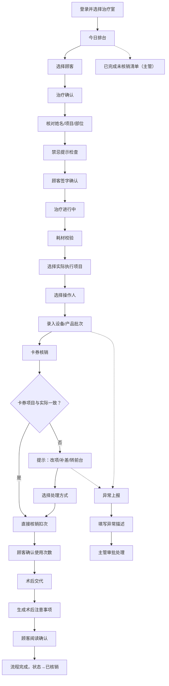

## 1. 产品概述

诊疗区平板端卡券核销台——为皮肤科治疗室、光电室、注射室打造的一站式治疗确认与卡券核销工具，消除治疗完成后再回前台补核销的断点，让护士、治疗师和医生在同一台平板上完成从排台查看到术后交代的完整闭环。

- 目标用户：皮肤科护士、治疗师、医生、科室主管
- 核心价值：减少治疗核销断点，提高诊疗效率，降低错核销/漏核销风险，实现治疗全流程数字化闭环

## 2. 核心功能

### 2.1 用户角色

| 角色 | 进入方式 | 核心权限 |
|------|----------|----------|
| 护士 | 工号+密码登录 | 排台查看、治疗确认、卡券核销、耗材校验、异常上报 |
| 治疗师 | 工号+密码登录 | 排台查看、治疗确认、卡券核销、耗材校验、术后交代 |
| 医生 | 工号+密码登录 | 治疗确认、卡券核销、改项审批、异常处理 |
| 科室主管 | 工号+密码登录 | 全部权限 + 已完成未核销清单查看 + 异常审批 |

### 2.2 功能模块

1. **今日排台**：按治疗室显示今日到诊顾客和预约项目，实时状态流转
2. **治疗确认**：治疗开始前核对姓名、项目、部位和禁忌提示，顾客签字确认
3. **卡券核销**：查看可用疗程卡、体验券和赠送次数，核销并处理不一致情况
4. **耗材校验**：选择实际执行项目、操作人、设备或产品批次，关联卡券核销
5. **术后交代**：生成术后注意事项给顾客，支持顾客在平板上确认已使用次数
6. **异常上报**：护士上报卡券不足、顾客争议、系统无券等异常，主管审批

### 2.3 页面详情

| 页面名称 | 模块名称 | 功能描述 |
|----------|----------|----------|
| 登录页 | 身份认证 | 工号+密码登录，选择当前治疗室（皮肤科治疗室/光电室/注射室），角色自动识别 |
| 今日排台 | 治疗室筛选 | 顶部切换治疗室标签，显示对应房间今日所有预约 |
| 今日排台 | 顾客卡片列表 | 按时间排序显示顾客头像、姓名、预约项目、状态标签（待治疗/治疗中/已完成/已核销） |
| 今日排台 | 状态筛选 | 支持按状态快速筛选顾客 |
| 今日排台 | 快捷操作 | 点击顾客卡片进入治疗确认流程 |
| 治疗确认 | 顾客信息核对 | 显示姓名、年龄、性别、就诊卡号，需核对身份 |
| 治疗确认 | 项目核对 | 显示预约项目名称、治疗部位、预计时长，高亮禁忌提示 |
| 治疗确认 | 禁忌提示 | 红色警示框显示过敏史、禁忌症、特殊提醒 |
| 治疗确认 | 签字确认 | 顾客在平板上签字确认开始治疗，记录时间戳 |
| 卡券核销 | 可用卡券列表 | 显示顾客名下所有可用疗程卡（剩余次数）、体验券（有效期）、赠送次数 |
| 卡券核销 | 核销操作 | 选择本次使用的卡券，扣除对应次数/次数+1 |
| 卡券核销 | 不一致处理 | 卡券项目与实际治疗不一致时，弹出提示：改项/补差价/转前台处理 |
| 卡券核销 | 使用次数确认 | 显示累计已使用次数，顾客在平板上点击确认 |
| 耗材校验 | 实际执行项目 | 从预设项目列表中选择本次实际执行的项目（可能与预约不同） |
| 耗材校验 | 操作人选择 | 选择本次操作的治疗师/医生 |
| 耗材校验 | 设备/产品批次 | 选择使用的设备编号或录入产品批次号 |
| 耗材校验 | 完成确认 | 确认后自动记录治疗完成时间，状态流转为"已完成" |
| 术后交代 | 注意事项生成 | 根据治疗项目自动生成术后注意事项清单 |
| 术后交代 | 顾客确认 | 顾客在平板上阅读并确认注意事项，可一键发送至顾客手机 |
| 术后交代 | 使用次数展示 | 展示本次核销后卡券剩余次数，顾客确认 |
| 异常上报 | 异常类型选择 | 卡券不足/顾客争议/系统无券/其他 |
| 异常上报 | 异常详情 | 填写异常描述，可拍照上传 |
| 异常上报 | 异常列表 | 科室主管查看当天异常列表，审批处理 |
| 已完成未核销 | 清单查看 | 科室主管查看当天已完成但未核销的治疗记录，支持批量处理 |

## 3. 核心流程

顾客到达治疗室后，护士在平板上查看今日排台确认顾客信息，核对姓名、项目、部位及禁忌提示后顾客签字开始治疗。治疗结束后，治疗师选择实际执行项目、操作人和设备/产品批次，系统进入卡券核销环节——若卡券项目与实际治疗一致则直接核销扣次，不一致则提示改项、补差或转前台处理。核销完成后顾客确认已使用次数，系统生成术后注意事项供顾客阅读确认。如遇卡券不足、顾客争议等异常情况，护士可随时上报，科室主管审批处理。科室主管可查看当天已完成未核销清单，确保无遗漏。

## 4. 用户界面设计

### 4.1 设计风格

- **主色调**：医疗级深青蓝 (#0A6E6E) + 暖白 (#FAFAF8)，辅以琥珀警示色 (#E8A838) 和珊瑚红异常色 (#E85D5D)
- **按钮风格**：大尺寸圆角按钮（圆角12px），适合平板触摸操作，主操作按钮有轻微3D按压感
- **字体**：标题使用 Noto Sans SC Medium/Bold，正文使用 Noto Sans SC Regular，数字使用 DM Mono 等宽字体
- **布局风格**：左侧导航栏 + 右侧内容区，卡片式布局，信息密度适中
- **图标风格**：线性图标，线条2px，与医疗场景匹配的简约专业风格

### 4.2 页面设计概览

| 页面名称 | 模块名称 | UI要素 |
|----------|----------|--------|
| 登录页 | 身份认证 | 居中卡片式登录框，治疗室选择用大按钮，深色渐变背景 |
| 今日排台 | 治疗室筛选 | 顶部横向标签栏，选中态有底部色条 |
| 今日排台 | 顾客卡片列表 | 纵向滚动卡片列表，每张卡片含头像、姓名、项目名、时间、状态标签（彩色胶囊） |
| 今日排台 | 状态筛选 | 横向胶囊筛选栏，支持多选 |
| 治疗确认 | 信息核对 | 上半部分顾客信息卡，下半部分项目核对卡，禁忌用红色警示框 |
| 治疗确认 | 签字确认 | 底部全宽签字区域，白色画布，黑色签字笔触 |
| 卡券核销 | 卡券列表 | 卡券风格卡片（仿实体卡），显示卡名、剩余次数/有效期 |
| 卡券核销 | 不一致弹窗 | 居中模态框，三个大按钮：改项/补差/转前台，按钮颜色区分 |
| 耗材校验 | 表单 | 分组表单，项目用多选标签，操作人用头像列表，批次用手动输入+扫码 |
| 术后交代 | 注意事项 | 打印预览风格卡片，带图标列表，底部顾客确认按钮 |
| 异常上报 | 上报表单 | 底部抽屉式弹出，异常类型用图标选择，描述区多行输入，拍照按钮 |
| 已完成未核销 | 清单 | 表格式列表，每行含快捷核销按钮，支持批量勾选 |

### 4.3 响应式与触控优化

- **桌面优先**：主要适配 iPad Pro 12.9" 及同级平板（1024×1366 竖屏为主）
- **触控优化**：所有可交互元素最小点击区域 44×44px，按钮间距 ≥ 12px
- **横竖屏**：竖屏为默认布局，横屏时左侧导航变为顶部导航
- **签字区域**：全宽画布，支持手指和触控笔，笔触平滑跟随

### 4.4 无3D场景
