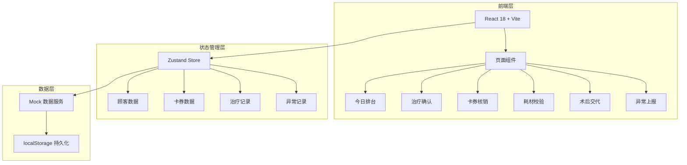
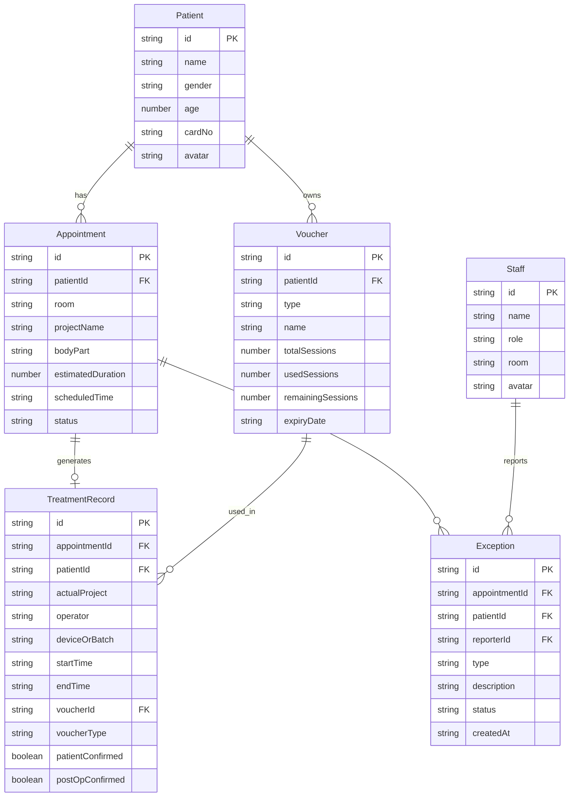

## 1. 架构设计



## 2. 技术说明

- **前端框架**：React@18 + TypeScript
- **样式方案**：Tailwind CSS@3 + CSS Variables（主题色）
- **构建工具**：Vite
- **状态管理**：Zustand（轻量、适合平板单页应用）
- **路由**：React Router v6
- **签名组件**：react-signature-canvas
- **图标**：Lucide React
- **动画**：Framer Motion
- **后端**：无（纯前端 Mock 数据，使用 localStorage 持久化）
- **数据源**：内置 Mock 数据模拟真实业务场景

## 3. 路由定义

| 路由 | 用途 |
|------|------|
| `/login` | 登录页，工号+密码，选择治疗室 |
| `/` | 今日排台主页，显示当前治疗室顾客列表 |
| `/patient/:id/confirm` | 治疗确认页，核对信息+签字 |
| `/patient/:id/voucher` | 卡券核销页，选择卡券并核销 |
| `/patient/:id/consumable` | 耗材校验页，录入执行项目和耗材 |
| `/patient/:id/post-op` | 术后交代页，注意事项+顾客确认 |
| `/patient/:id/exception` | 异常上报页，上报异常 |
| `/exceptions` | 异常列表页（主管） |
| `/unverified` | 已完成未核销清单（主管） |

## 4. API 定义（无后端，使用 Mock 服务）

### 4.1 数据类型定义

```typescript
interface Staff {
  id: string;
  name: string;
  role: 'nurse' | 'therapist' | 'doctor' | 'supervisor';
  room: 'skin_treatment' | 'photoelectric' | 'injection';
  avatar: string;
}

interface Patient {
  id: string;
  name: string;
  gender: 'male' | 'female';
  age: number;
  cardNo: string;
  avatar: string;
  allergies: string[];
  contraindications: string[];
  specialNotes: string[];
}

interface Appointment {
  id: string;
  patientId: string;
  room: string;
  projectName: string;
  bodyPart: string;
  estimatedDuration: number;
  scheduledTime: string;
  status: 'waiting' | 'in_progress' | 'completed' | 'verified';
}

interface Voucher {
  id: string;
  patientId: string;
  type: 'course_card' | 'experience_voucher' | 'gift_session';
  name: string;
  totalSessions: number;
  usedSessions: number;
  remainingSessions: number;
  expiryDate: string;
  applicableProjects: string[];
}

interface TreatmentRecord {
  id: string;
  appointmentId: string;
  patientId: string;
  actualProject: string;
  operator: string;
  deviceOrBatch: string;
  startTime: string;
  endTime: string;
  voucherId: string;
  voucherType: 'normal' | 'change_item' | 'price_diff' | 'to_front_desk';
  patientSignature: string;
  patientConfirmed: boolean;
  postOpConfirmed: boolean;
}

interface Exception {
  id: string;
  appointmentId: string;
  patientId: string;
  reporterId: string;
  type: 'voucher_insufficient' | 'patient_dispute' | 'no_voucher_in_system' | 'other';
  description: string;
  photos: string[];
  status: 'pending' | 'approved' | 'rejected';
  createdAt: string;
  resolvedAt?: string;
  resolvedBy?: string;
}

interface PostOpInstruction {
  projectName: string;
  items: string[];
}
```

## 5. 无后端服务架构

## 6. 数据模型

### 6.1 数据模型定义



### 6.2 数据初始化

使用 TypeScript Mock 数据文件，包含：
- 6 名医护人员（覆盖4种角色）
- 10 名顾客（含过敏/禁忌信息）
- 15 条今日预约（覆盖3个治疗室、4种状态）
- 20 张卡券（疗程卡/体验券/赠送次数）
- 术后注意事项模板库
